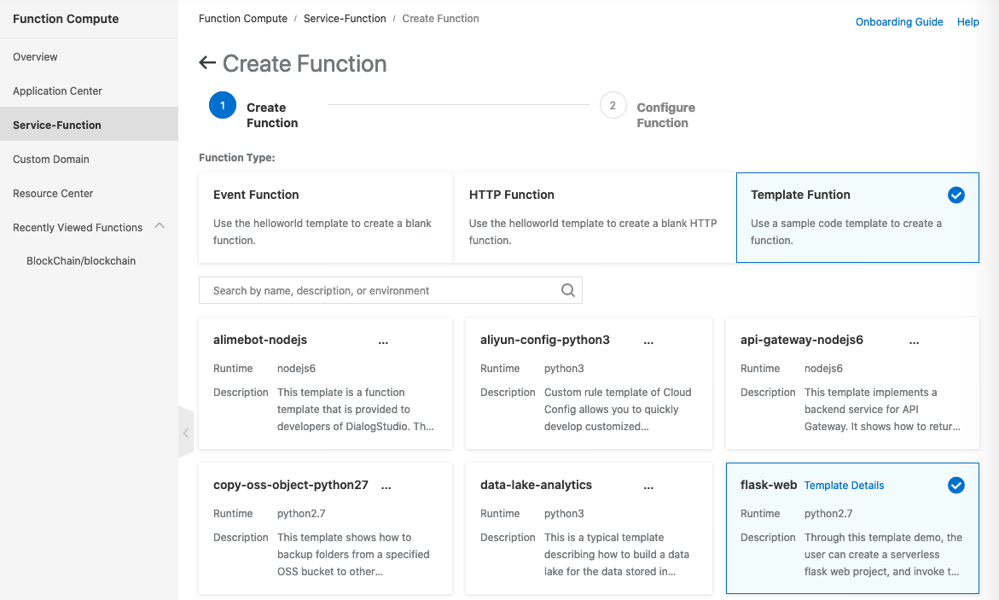
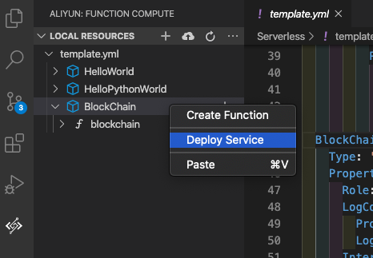

# Technical Demonstration: Creating a Blockchain Application on Alibaba Cloud Function Compute by Nishant Iyer

## Introduction

In this technical demonstration, we will explore the implementation of a blockchain application on Alibaba Cloud Function Compute. This demonstration is based on an in-depth analysis of blockchain concepts inspired by the work of Daniel van Flymen. We will also reference Ken Formm's study on the synergies between serverless computing and blockchain technology.

## Modifying the Source Code

To tailor the blockchain application to our requirements, we have made significant modifications to the original source code. One notable addition is the creation of a new class file called `Blockchain.py`. This file encapsulates the core functionality of the blockchain and enables seamless integration with Alibaba Cloud Function Compute.

## Development Environment Setup

Before diving into the implementation, let's ensure we have the necessary tools in place. We recommend using Visual Studio Code as it offers a comprehensive development experience. To simplify the deployment process, we need to install the Aliyun Serverless extension, which provides seamless integration with Alibaba Cloud services.

## Implementation Steps

### Step 1: Creating a New Function in Function Compute

To kickstart our blockchain application, we need to create a new function in Alibaba Cloud Function Compute. This can be achieved by selecting the "Template Function" option within the Function Compute service. Follow the prompts to set up the function, ensuring to provide relevant details such as service name, function name, function handler, memory allocation, timeout settings, instance concurrency, and triggers.

### Step 2: Configuring the Function

Once the function is created, we proceed with configuring it to align with our application's requirements. This involves fine-tuning various settings, including memory allocation, timeout thresholds, and instance concurrency limits. Additionally, we set up triggers to define the event sources that will invoke our function.

### Step 3: Code Development with Visual Studio Code

Utilizing the power of Visual Studio Code, we streamline the code development process for our blockchain application. By leveraging the Aliyun Serverless extension, we gain access to powerful features such as local function testing and debugging. Once the extension is installed, we can effortlessly download the newly created function from Alibaba Cloud and begin coding within the `main.py` file.

#### Optional Step: Docker Setup

For local testing purposes, it is recommended to install Docker. Docker provides a convenient containerization platform that replicates the production environment, enabling efficient function testing. By following the official Docker installation instructions and creating a Docker account, we ensure a smooth testing experience.

### Step 4: Modifying the Execution Environment

To ensure compatibility and optimal performance, we need to modify the execution environment within the code. By specifying the execution environment as Python 3 (using `#!/usr/bin/env python3` at Line 1), we leverage the latest Python features and libraries required by our blockchain application.

### Step 5: Deploying to Function Compute

Once our blockchain application is thoroughly tested and validated, we are ready to deploy it to Alibaba Cloud Function Compute. Using the convenient deployment feature in Visual Studio Code, we can seamlessly upload our function code and associated dependencies. This ensures a swift and reliable deployment process.

## API Testing and Usage

Upon successful deployment, we can interact with our blockchain application using API testing tools like Postman. The following endpoints are available for testing and exploring the capabilities of our application:

1. **Mine Endpoint** (`url/mine`): Sends a GET request to initiate the mining process.

2. **Create Transaction Endpoint** (`url/transactions/new`): Sends a POST request with a JSON body to create a new transaction. The JSON payload includes details such as the sender's address, recipient's address, and transaction amount.

3. **Return Full Chain Endpoint** (`url/chain`): Retrieves the complete blockchain by sending a GET request.

4. **Register New Node Endpoint** (`url/nodes/register`): Registers a new node in the blockchain network by sending a POST request with a JSON body. The JSON payload contains the URL of the node to be added.

5. **Resolve Chain with Consensus Algorithm Endpoint** (`url/nodes/resolve`): Resolves any conflicts within the blockchain network by sending a GET request. This triggers the consensus algorithm to ensure all nodes have an identical copy of the blockchain.

Please note that the specific URLs can be found in the Trigger Menu within Alibaba Cloud Function Compute.

---

Congratulations! You have now successfully created and deployed a blockchain application on Alibaba Cloud Function Compute. Feel free to explore and test the various endpoints to gain a deeper understanding of the application's functionality.

By Nishant Iyer